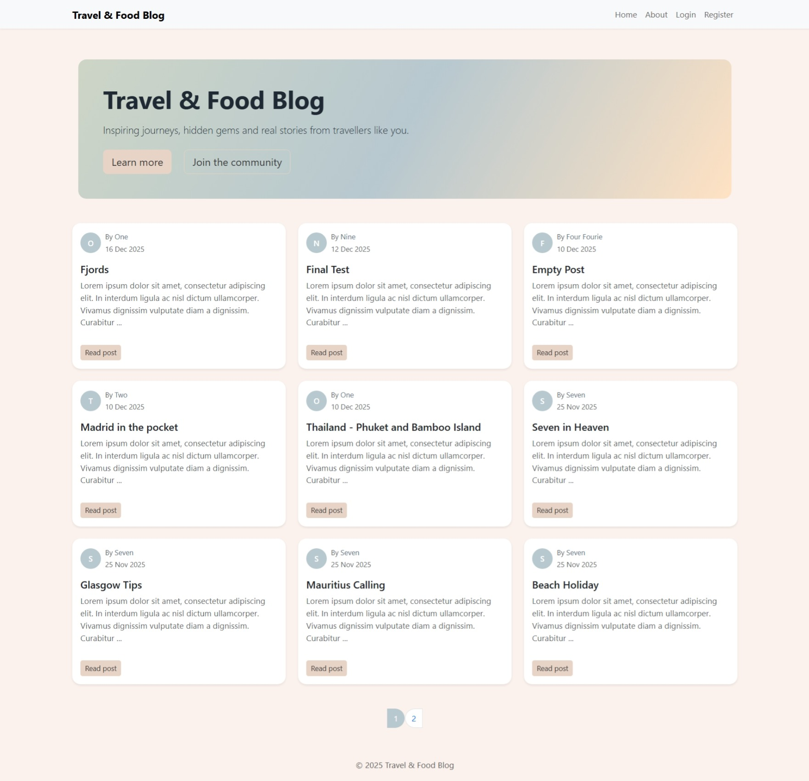
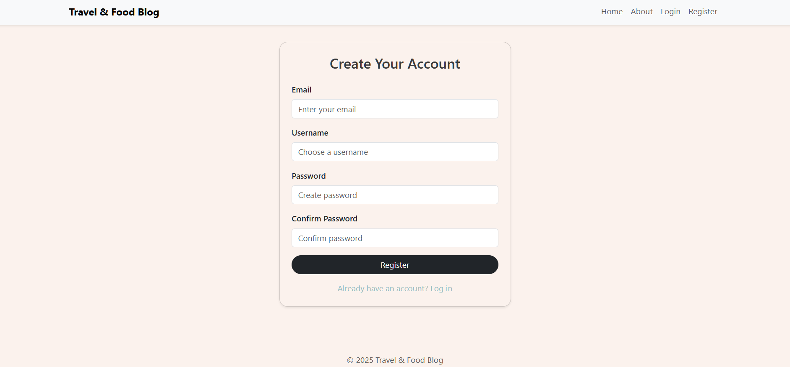
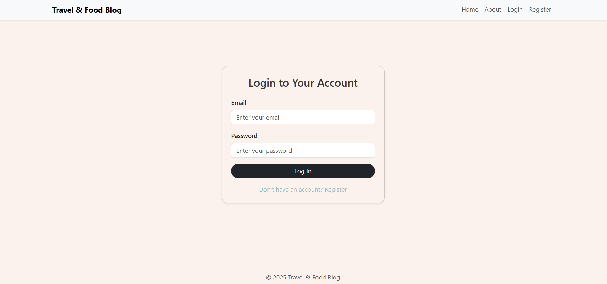
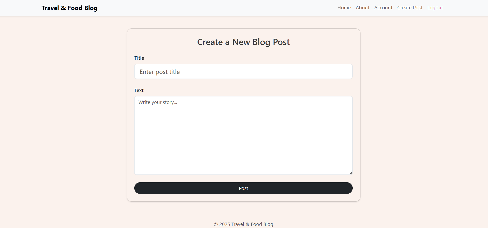
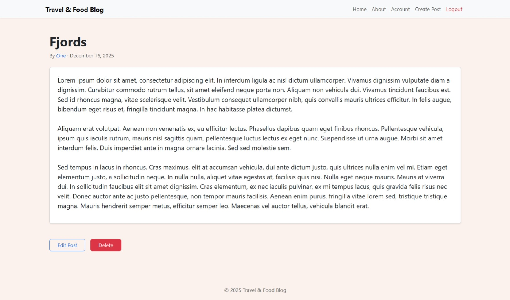
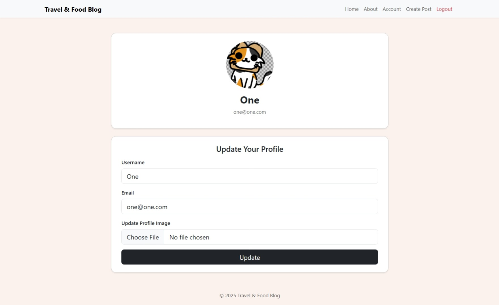

# Multi-User Blog (Flask Project)

A full CRUD multi-user blog application built with **Python**, **Flask**, **SQLite**, **WTForms**, and **SQLAlchemy**.  
Users can register, log in, update profiles, create blog posts, edit posts, and delete posts.

This project was developed as part of a university module to demonstrate backend development, UI templating, secure authentication, and database integration.

---

## 🚀 Features

### 👤 User Features

- User registration with secure password hashing
- User login/logout
- User profile update (email, username, profile picture)
- User dashboard with list of posts
- View posts of other users

### ✍️ Blog Functionality

- Create blog posts
- Edit blog posts
- Delete posts with a confirmation modal
- Pagination on the main page

### 🔐 Security

- Password hashing (Werkzeug)
- CSRF protection (WTForms)
- Login required for protected routes
- User-owned content enforced (`abort(403)`)

### 🗄️ Database

- SQLite (development)
- SQLAlchemy ORM models
- Migration system with Flask-Migrate

---

## 🧱 Tech Stack

| Layer     | Technology                    |
| --------- | ----------------------------- |
| Backend   | Python, Flask                 |
| Database  | SQLite + SQLAlchemy           |
| Frontend  | Bootstrap 5, Jinja2 templates |
| Security  | Werkzeug hashing, Flask-Login |
| Dev Tools | VS Code, Git, GitHub          |

---

## 📦 Installation

### 1. Clone the repository

```sh
git clone https://github.com/annasenem/multi_user_blog.git
cd multi_user_blog
```

### 2. Create virtual environment

```sh
python -m venv .venv
source .venv/bin/activate    # Mac/Linux
.venv\Scripts\activate       # Windows
```

### 3. Install dependencies

```sh
pip install -r requirements.txt
```

4. Run database migrations

```sh
flask db upgrade
```

5. Run the application

```sh
python app.py
```

---

## Project Structure

```
multi_user_blog/
│
├── app.py # Application entry point
├── requirements.txt # Required Python packages
├── migrations/ # Database migration files
├── travelcompanyblog/ # Main application package
│ ├── models.py # Database models
│ ├── core/ # Core routes (home page)
│ ├── users/ # User authentication + views
│ ├── blog_posts/ # Blog post CRUD logic
│ ├── templates/ # Jinja2 templates
│ └── static/ # Images, CSS, uploads
└── README.md
```

---

## Screenshots

### Home Page



### Registration Page



### Login Page



### Create Post



### Blog Post Detail Page



### Delete confirmation Modal


### Account Page



---

## How to Use

1. Register a new user account.
2. Log in using your credentials.
3. Navigate to “Create Post” to publish a blog post.
4. Edit or delete your own posts.
5. View posts from all users on the home page.
6. Update your profile (username, email, profile picture).

---

## Database Models

### User

- id
- username
- email
- password_hash
- profile_image
- relationship: posts → BlogPost

### BlogPost

- id
- user_id (ForeignKey)
- title
- text
- date

---

## Future Improvements

- Switch to PostgreSQL for production deployment
- Add comment system under posts
- Add categories/tags for posts
- Add email verification & password reset
- Dark mode UI
- Docker containerisation

---

## License

This project is licensed under the MIT License.
